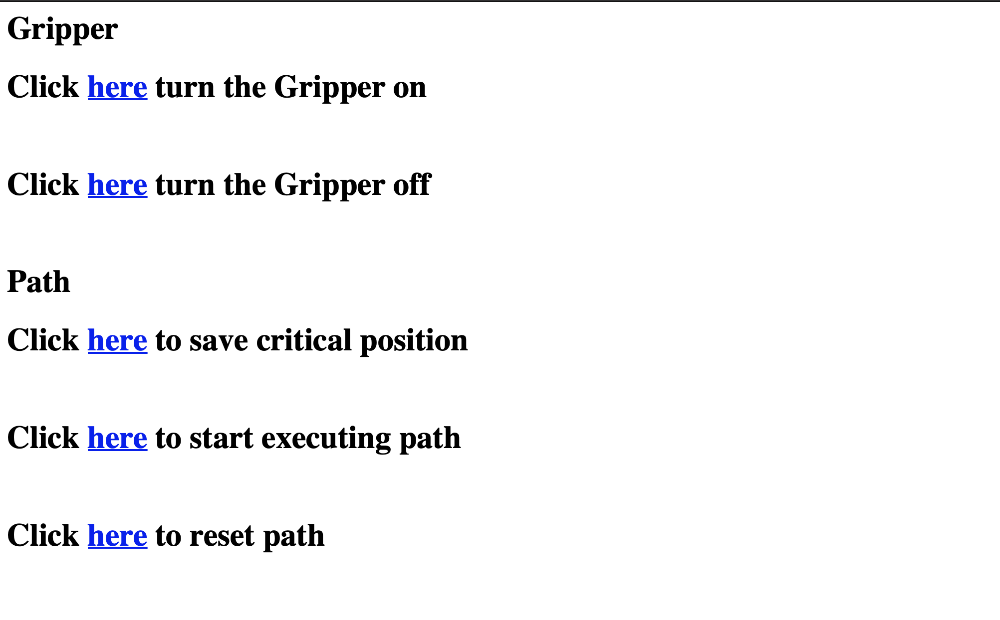

# Braccio-Wifi
Control Braccio Robot Arm through wifi and gyroscope, which is built-in inside Arduino UNO Wifi Rev2. 

## Braccio Robot 
https://store.arduino.cc/usa/tinkerkit-braccio
## Function 
1. Control Braccion using gyroscope.  
2. Let Braccio move according to pre-stored path. 

## User Interface

